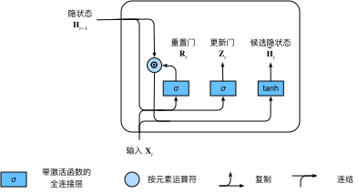

# GRU（门控循环单元）

## 关注一个序列
- 不是每个观察值都是同等重要
- 想只记住相关的观察需要：
  - 能关注的机制（更新门）
  - 能遗忘的机制（重制门）

## 重制门 更新门

$$
\begin{aligned}
\mathbf{R}_t = \sigma(\mathbf{X}_t \mathbf{W}_{xr} + \mathbf{H}_{t-1} \mathbf{W}_{hr} + \mathbf{b}_r)\\
\mathbf{Z}_t = \sigma(\mathbf{X}_t \mathbf{W}_{xz} + \mathbf{H}_{t-1} \mathbf{W}_{hz} + \mathbf{b}_z)
\end{aligned}
$$

## 候选隐状态

$$\tilde{\mathbf{H}}_t = \tanh(\mathbf{X}_t \mathbf{W}_{xh} + \left(\mathbf{R}_t \odot \mathbf{H}_{t-1}\right) \mathbf{W}_{hh} + \mathbf{b}_h)$$

- 这里由于 $\mathbf{R}_t$ 使用 sigmoid激活函数，矩阵中元素均属于0到1
- 与前一个隐状态 `Hadamard积` 后有些值变0 $\rightarrow$ 重制门

## 隐状态

$$\mathbf{H}_t = \mathbf{Z}_t \odot \mathbf{H}_{t-1}  + (1 - \mathbf{Z}_t) \odot \tilde{\mathbf{H}}_t$$

- 当更新门$\mathbf{Z}_t$接近$1$时，模型就倾向只保留旧状态
- 当$\mathbf{Z}_t$接近$0$时，新的隐状态$\mathbf{H}_t$就会接近候选隐状态$\tilde{\mathbf{H}}_t$