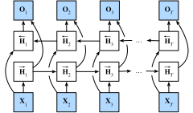

# bi-RNN（双向循环神经网络）
- 双向循环神经网络通过反向更新隐藏层利用方向时间信息
- 通常用来对序列抽取特征、填空，而不是预测未来

## 未来很重要
- 取决于过去和未来的上下文，可以填很不一样的词
- 在填空的时候我们也可以看未来

## 双向RNN

$$
\begin{aligned}
\overrightarrow{\mathbf{H}}_t &= \phi(\mathbf{X}_t \mathbf{W}_{xh}^{(f)} + \overrightarrow{\mathbf{H}}_{t-1} \mathbf{W}_{hh}^{(f)}  + \mathbf{b}_h^{(f)})\\
\overleftarrow{\mathbf{H}}_t &= \phi(\mathbf{X}_t \mathbf{W}_{xh}^{(b)} + \overleftarrow{\mathbf{H}}_{t+1} \mathbf{W}_{hh}^{(b)}  + \mathbf{b}_h^{(b)})
\end{aligned}
$$

$$\mathbf{H}_t = [\overrightarrow{\mathbf{H}}_{t}, \overleftarrow{\mathbf{H}}_t]$$

$$\mathbf{O}_t = \mathbf{H}_t \mathbf{W}_{hq} + \mathbf{b}_q$$

- 一个前向RNN隐层
- 一个反向RNN隐层
- 合并两个隐状态得到输出