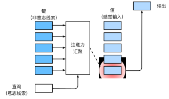

# 注意力机制

## 心理学
- 动物需要在复杂环境下有效关注值得注意的点
- 心理学框架：人类根据随意线索和不随意线索选择注意点
  - 不随意线索 $\rightarrow$ 你本来没打算看它，但它因为太显眼，自动把你的注意力吸走了
  - 随意线索 $\rightarrow$ 你心里有一个目标，然后主动根据这个目标去寻找相关信息

## 注意力机制
- 卷积、全连接、池化层都只考虑不随意线索 
  - 输入本身的某些特征很突出，所以模型容易关注它们
- 注意力机制则显式的考虑随意线索
  - 当前任务需要什么信息，模型就根据这个需求去输入里找相关内容

- 随意线索被称之为查询（query）
- 每个输入是一个值（value）和不随意线索（key）的对
- 通过注意力池化层来偏向性的选择某些输入

## Nadaraya-Watson核回归
这是一种简单注意力权重的设计，用于理解注意力机制

### 非参注意力
Nadaraya-Watson 核回归
$$f(x) = \sum_{i=1}^{n}\frac{K(x-x_i)}{\sum_{j=1}^{n}K(x-x_j)}y_i = \sum_{i=1}^n \alpha(x, x_i) y_i$$
- Nadaraya-Watson 核回归本质上就是一种“基于距离相似度的注意力机制”

|Nadaraya-Watson 核回归|注意力机制|
|---|---|
|当前要预测的 x|query|
|训练输入 x|key|
|训练标签 y|value|
|核函数算出的相似度|attention score|
|归一化后的权重 α|attention weight|
|加权平均 y|attention 输出|

### 使用高斯核

$$K(u) = \frac{1}{\sqrt{2\pi}} \exp(-\frac{u^2}{2})$$

$$f(x) = \sum_{i=1}^n \frac{\exp\left(-\frac{1}{2}(x - x_i)^2\right)}{\sum_{j=1}^n \exp\left(-\frac{1}{2}(x - x_j)^2\right)} y_i = \sum_{i=1}^n \mathrm{softmax}\left(-\frac{1}{2}(x - x_i)^2\right) y_i$$

### 参数化

$$f(x) = \sum_{i=1}^n \mathrm{softmax}\left(-\frac{1}{2}((x - x_i)w)^2\right) y_i$$