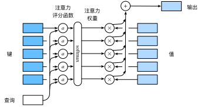

# 注意力分数

## 评分函数

- $\mathbf{q} \in \mathbb{R}^q$
- $m$个“键－值”对$(\mathbf{k}_1, \mathbf{v}_1), \ldots, (\mathbf{k}_m, \mathbf{v}_m)$，其中$\mathbf{k}_i \in \mathbb{R}^k$，$\mathbf{v}_i \in \mathbb{R}^v$
- 注意力汇聚函数$f$就被表示成值的加权和：

$$f(\mathbf{q}, (\mathbf{k}_1, \mathbf{v}_1), \ldots, (\mathbf{k}_m, \mathbf{v}_m)) = \sum_{i=1}^m \alpha(\mathbf{q}, \mathbf{k}_i) \mathbf{v}_i \in \mathbb{R}^v$$

- 其中查询$\mathbf{q}$和键$\mathbf{k}_i$的注意力权重（标量）是通过注意力评分函数$a$将两个向量映射成标量，再经过softmax运算得到的：

$$\alpha(\mathbf{q}, \mathbf{k}_i) = \mathrm{softmax}(a(\mathbf{q}, \mathbf{k}_i)) = \frac{\exp(a(\mathbf{q}, \mathbf{k}_i))}{\sum_{j=1}^m \exp(a(\mathbf{q}, \mathbf{k}_j))} \in \mathbb{R}$$

**下面讨论注意力评分函数的两种设计**

## Additive Attention
一般来说，当查询和键是不同长度的矢量时，可以使用加性注意力作为评分函数

- $\mathbf{q} \in \mathbb{R}^q$，$\mathbf{k} \in \mathbb{R}^k$，*加性注意力*（additive attention）的评分函数为

$$a(\mathbf q, \mathbf k) = \mathbf w_v^\top \text{tanh}(\mathbf W_q\mathbf q + \mathbf W_k \mathbf k) \in \mathbb{R}$$

可学习的参数是
- $\mathbf W_q\in\mathbb R^{h\times q}$，$\mathbf W_k\in\mathbb R^{h\times k}$ 和 $\mathbf w_v\in\mathbb R^{h}$。

等价于将查询和键连结起来后输入到一个多层感知机（MLP）中，感知机包含一个隐藏层，其隐藏单元数是一个超参数$h$，通过使用$\tanh$作为激活函数，并且禁用偏置项。

## Scaled Dot-Product Attention
使用点积可以得到计算效率更高的评分函数， 但是点积操作要求查询和键具有相同的长度

$$a(\mathbf q, \mathbf k) = \mathbf{q}^\top \mathbf{k}  /\sqrt{d}$$

向量化版本
- $\mathbf{Q} \in \mathbb{R}^{n \times d}$，$\mathbf{K} \in \mathbb{R}^{m \times d}$， $\mathbf{V} \in \mathbb{R}^{m \times v}$
- 注意力分数：$a(\mathbf{Q},\mathbf{K}) = \mathbf{Q}\mathbf{K}^T/\sqrt{d} \in \mathbb{R}^{n \times m}$
- 注意力池化： $\mathbf{F} = \operatorname{softmax}\!\left(a(\mathbf{Q}, \mathbf{K})\right)\mathbf{V} \in \mathbb{R}^{n \times v}$