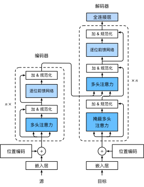

# Transformer

## Transformer 架构
- 基于编码器-解码器架构来处理序列对
- 跟使用注意力的 seq2seq不同，Transformer是纯基于注意力

## 多头注意力

- 对同一 key，value，query，希望抽取不同的信息
  - 例如短距离关系和长距离关系
- 多头注意力使用 $h$ 个独立的注意力池化
  - 合并各个头（head）输出得到最终输出

**数学表示**
- query $\mathbf{q} \in \mathbb{R}^{d_q}$，key $\mathbf{k} \in \mathbb{R}^{d_k}$，value $\mathbf{v} \in \mathbb{R}^{d_v}$
- 头 $i$ 的额外可学习参数 $\mathbf{W}_i^{(q)} \in \mathbb{R}^{p_q \times d_q},\space \mathbf{W}_i^{(k)} \in \mathbb{R}^{p_k \times d_k},\space \mathbf{W}_i^{(v)} \in \mathbb{R}^{p_v \times d_v}$
- 头 $i$ 的输出 $\mathbf{h}_i = f(\mathbf{W}_i^{(q)}\mathbf{q},\mathbf{W}_i^{(k)}\mathbf{k},\mathbf{W}_i^{(v)}\mathbf{v}) \in \mathbb{R}^{p_v}$
- 输出的可学习参数 $\mathbf{W}_o \in \mathbb{R}^{p_o \times hp_v}$
- 多头注意力的输出
    $$\mathbf{W}_o \begin{bmatrix} h_1 \\ \vdots \\ h_h \end{bmatrix} \in \mathbb{R}^{p_o}$$

## 有掩码的多头注意力
- 解码器对序列中一个元素输出时，不应该考虑该元素之后的元素
- 可以通过掩码来实现
  - 也就是计算 $\mathbf{x}_i$ 输出时，假装当前序列长度为 $i$

## 基于位置的前馈网络
- 将输入形状由 $(b,n,d)$ 变换成 $(bn,d)$
- 作用两个全连接层
- 输出形状由 $(bn,d)$ 变化回 $(b,n,d)$
- 等价于两层核窗口为 1 的一维卷积层

## 层归一化
- 批量归一化对每个特征/通道里元素进行归一化
  - 不适合序列长度会变的NLP应用
- 层归一化对每个样本里的元素进行归一化

## 信息传递
- 编码器中的输出 $\mathbf{y}_1,\cdots,\mathbf{y}_n$
- 将其作为解码器中第 $i$ 个 Transformer 块中多头注意力的 key 和 value
  - query 来自目标序列
- 意味着编码器和解码器中块的个数和输出维度都是一样的

## 预测
- 预测第 $t+1$ 个输出时
- 解码器中输入前 $t$ 个预测值
  - 在自注意力中，前 $t$ 个预测值作为 key 和 value，第 $t$ 个预测值还作为query