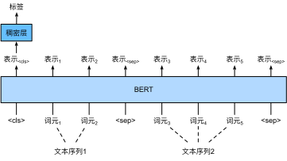
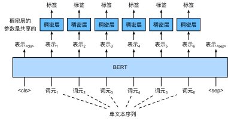
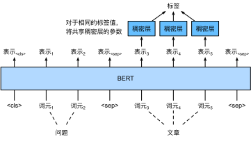

# BERT 微调

## 微调 Bert
- BERT对每一个词元返回抽取了上下文信息的特征向量
- 不同的任务使用不同的特征

## 句子分类
- 将 \<cls> 对应的向量输入到全连接层分类

## 命名实体识别
- 识别一个词元是不是命名实体，例如人名、机构、位置
- 将非特殊词元放进全连接层分类

## 问题回答
- 给定一个问题，和描述文字，找出一个片段作为回答
- 对片段中的每个词元预测它是不是回答的开头或结束

