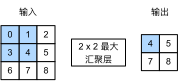

# 池化层

## 二维最大池化
- 返回滑动窗口中的最大值


## 填充，步幅和多个通道
- 池化层与卷积类似，都具有填充和步幅
- 没有可以学习的参数
- 在每个输入通道应用池化层以获得相应的输出通道
- 输出通道数 = 输出通道数

## 平均池化层
- 最大池化层: 每个窗口中最强的模式信号
- 平均池化层：将最大池化层中的“最大”操作替换为“平均”

## 目的
- 通常作用在卷积层之后
- 用于缓解卷积敏感性

## 具体实现
```py
import torch
from torch import nn
```
```py
def pool2d(X, pool_size, mode='max'):
    p_h, p_w = pool_size
    Y = torch.zeros((X.shape[0] - p_h + 1, X.shape[1] - p_w + 1))
    for i in range(Y.shape[0]):
        for j in range(Y.shape[1]):
            if mode == 'max':
                Y[i, j] = X[i: i + p_h, j: j + p_w].max()
            elif mode == 'avg':
                Y[i, j] = X[i: i + p_h, j: j + p_w].mean()
    return Y
```