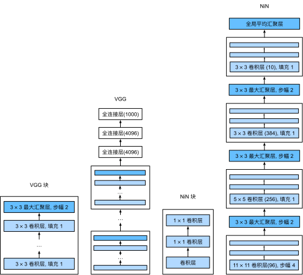

# NiN （网络中的网络）

## 全连接层的问题

- 卷积层需要较少的参数 $ c_i \times c_o \times k^2$
- 但卷积层后的第一个全连接层的参数很多
  - 占用空间很大
  - 使用很多带宽
  - 容易过拟合

## NiN块
- 一个卷积层后跟两个（全连接层）
  - 步幅1，无填充，输出形状跟卷积层输出一样
  - 起到全连接层的作用

## NiN架构
- 无全连接层
- 交替使用NiN块和步幅为2的最大池化层
  - 逐步减小高宽和增大通道数
- 最后使用全局平均池化层得到输出
  - 其输入通道数是类别数

## NiN vs VGG


## 代码实现

```py
import torch
from torch import nn
```
```py
def nin_block(in_channels, out_channels, kernel_size, strides, padding):
    return nn.Sequential(
        nn.Conv2d(in_channels, out_channels, kernel_size, strides, padding),
        nn.ReLU(),
        nn.Conv2d(out_channels, out_channels, kernel_size=1), nn.ReLU(),
        nn.Conv2d(out_channels, out_channels, kernel_size=1), nn.ReLU())
```
```py
net = nn.Sequential(
    nin_block(1, 96, kernel_size=11, strides=4, padding=0),
    nn.MaxPool2d(3, stride=2),
    nin_block(96, 256, kernel_size=5, strides=1, padding=2),
    nn.MaxPool2d(3, stride=2),
    nin_block(256, 384, kernel_size=3, strides=1, padding=1),
    nn.MaxPool2d(3, stride=2),
    nn.Dropout(0.5),
    # 标签类别数是10
    nin_block(384, 10, kernel_size=3, strides=1, padding=1),
    nn.AdaptiveAvgPool2d((1, 1)),
    # 将四维的输出转成二维的输出，其形状为(批量大小,10)
    nn.Flatten())
```