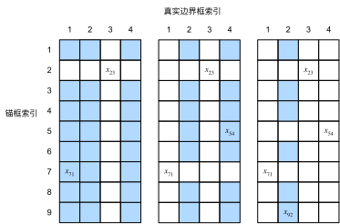

# 锚框
- 提出多个被称为锚框的区域
- 预测每个锚框里是否有关注的物体
- 如果是，预测从这个锚框到真实边缘框的偏移

## loU - 交并比
- loU用来计算两个框之间的相似度
  - 0表示为无重叠，1表示重合
- 这是Jacquard指数的一个特殊情况
  - 给定两个集合A和B
    $$ J(A,B) = \frac{|A\cap B|}{|A\cup B|}$$

## 在训练数据中标注锚框

### 赋予锚框标号

- 每个锚框是一个训练样本
- 将每个锚框，要么标注成背景，要么关联上一个真实边缘框
- 可能会生成大量的锚框
  - 这个导致的大量的负类的样本

### 将真实边界框分配给锚框

给定图像，假设锚框是$A_1, A_2, \ldots, A_{n_a}$，真实边界框是$B_1, B_2, \ldots, B_{n_b}$，其中$n_a \geq n_b$。
让我们定义一个矩阵$\mathbf{X} \in \mathbb{R}^{n_a \times n_b}$，其中第$i$行、第$j$列的元素$x_{ij}$是锚框$A_i$和真实边界框$B_j$的IoU。
该算法包含以下步骤。

1. 在矩阵$\mathbf{X}$中找到最大的元素，并将它的行索引和列索引分别表示为$i_1$和$j_1$。然后将真实边界框$B_{j_1}$分配给锚框$A_{i_1}$。这很直观，因为$A_{i_1}$和$B_{j_1}$是所有锚框和真实边界框配对中最相近的。在第一个分配完成后，丢弃矩阵中${i_1}^\mathrm{th}$行和${j_1}^\mathrm{th}$列中的所有元素。
1. 在矩阵$\mathbf{X}$中找到剩余元素中最大的元素，并将它的行索引和列索引分别表示为$i_2$和$j_2$。我们将真实边界框$B_{j_2}$分配给锚框$A_{i_2}$，并丢弃矩阵中${i_2}^\mathrm{th}$行和${j_2}^\mathrm{th}$列中的所有元素。
1. 此时，矩阵$\mathbf{X}$中两行和两列中的元素已被丢弃。我们继续，直到丢弃掉矩阵$\mathbf{X}$中$n_b$列中的所有元素。此时已经为这$n_b$个锚框各自分配了一个真实边界框。
1. 只遍历剩下的$n_a - n_b$个锚框。例如，给定任何锚框$A_i$，在矩阵$\mathbf{X}$的第$i^\mathrm{th}$行中找到与$A_i$的IoU最大的真实边界框$B_j$，只有当此IoU大于预定义的阈值时，才将$B_j$分配给$A_i$。

**理解**
- 很多 anchor 在“抢”几个真实框。
- 第一轮先保证：
  - 每个真实框至少有一个最合适的 anchor 负责。
- 第二轮再让：
  - 其他 IoU 足够高的 anchor 也加入负责真实框。
- 剩下 IoU 太低的 anchor 就当背景。

## 非极大值抑制（NMS）
- 每个锚框预测一个边缘框
- NMS可以合并相似的预测
  - 选中是非背景类的最大预测值
  - 去掉所有其他和它loU值大于$\theta$的预测
  - 重复上述过程知道所有预测要么被选中，要么被去掉