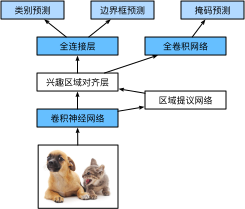

# 区域卷积神经网络

## R-CNN
- 使用启发式搜索算法来选择锚框
- 使用预训练模型来对每个锚框抽取特征
- 训练一个SVM来对类别分类
- 训练一个线性回归模型来预测边缘框偏移

### 兴趣区域（RoI）池化层
- 给定一个锚框，均匀分割成 $n \times m$ 块，输出每块里的最大值
- 不管锚框多大，总是输出 $ nm $ 个值

RoI 池化 = 把任意大小的候选框特征，压成固定大小的特征表格

## Fast R-CNN
与R-CNN相比，Fast R-CNN用来提取特征的卷积神经网络的输入是整个图像，而不是各个提议区域

## Faster R-CNN
- 使用一个区域提议网络来替代启发式搜索获得更好的锚框

## Mask R-CNN
- 如果有像素级别的标号，使用FCN来利用这些信息
